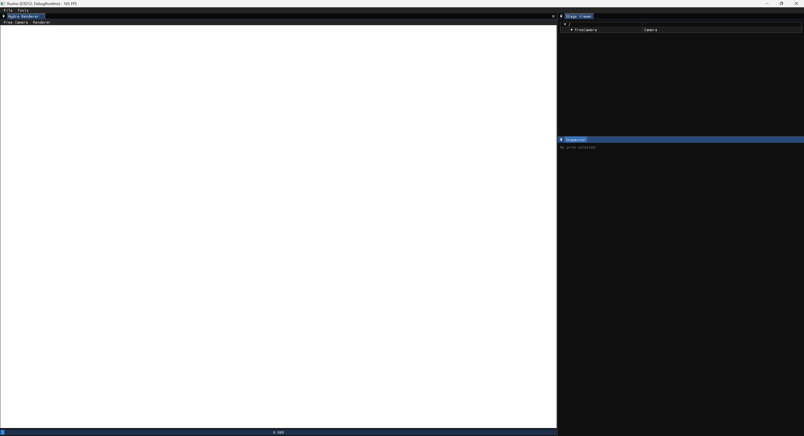
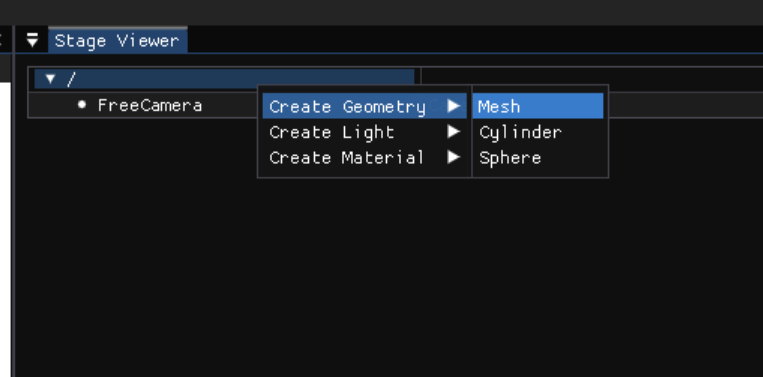
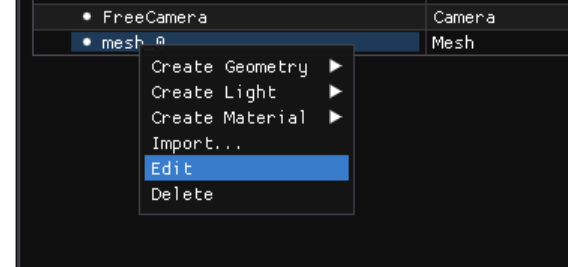
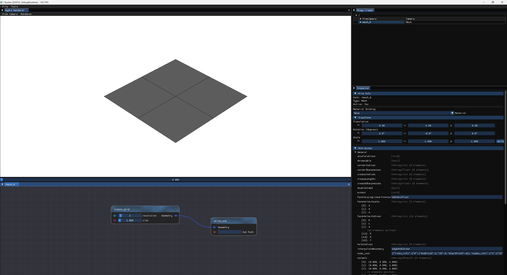

# Building

1. Download SDK

```
python .\configure.py --all --build_variant Debug --extract-sdk .\SDK.zip
``` 

```
mkdir build
cd build
cmake .. -G Ninja
ninja
```
```
cd Binaries/Debug
.\Ruzino.exe
```





